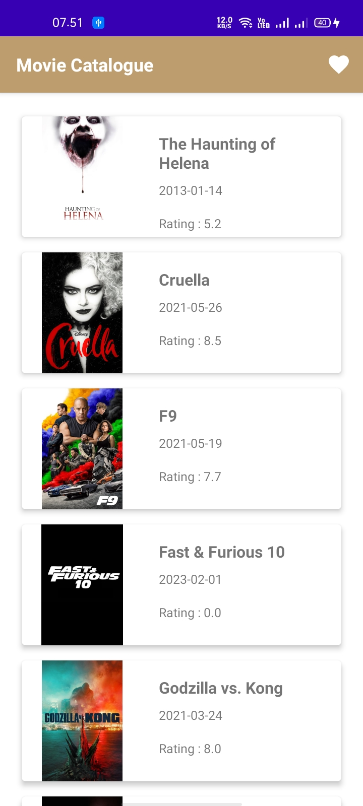
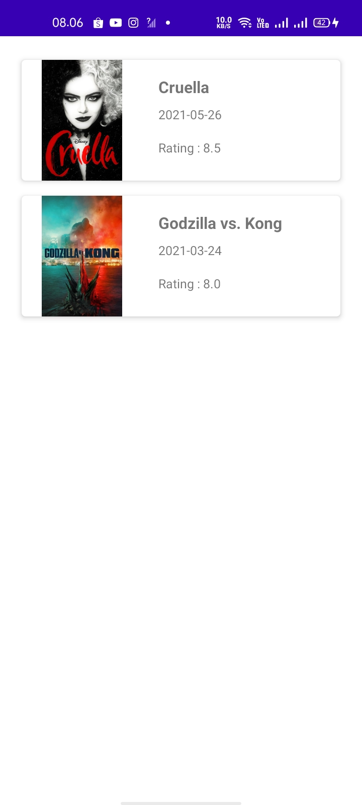
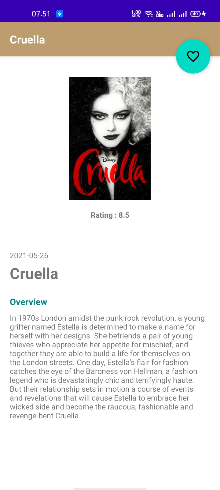

# MovieCatalogue MVVM Submission 1

### Menjadi Android Developer Expert (MADE) dari Dicoding

Aplikasi Movie Catalogue merupakan submission atau capstone project dari kelas Menjadi Android Developer Expert (MADE) dari dicoding, dan ini untuk memenuhi submission 1

### Project ini menerapkan MVVM, Clean Architecture & Modularization
- FAB for Favorite Movie
- Retrofit
- Coroutine Flow (Reactive Programming)
- Koin (Dependency Injection)
- Android Library & Dynamic Feature

## Logo

## Preview App

